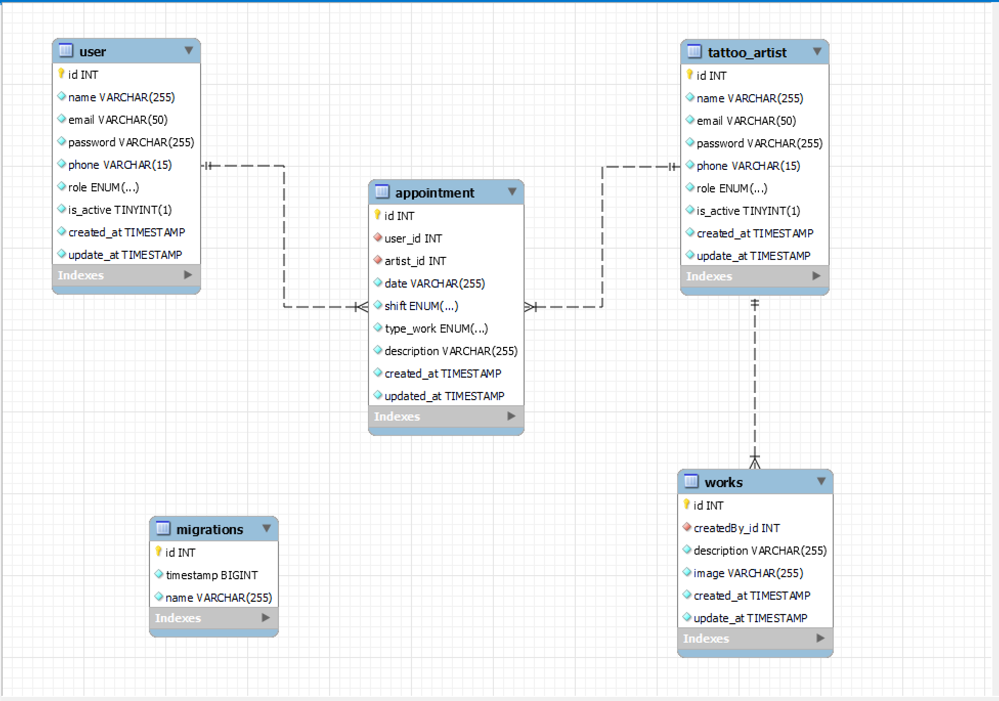
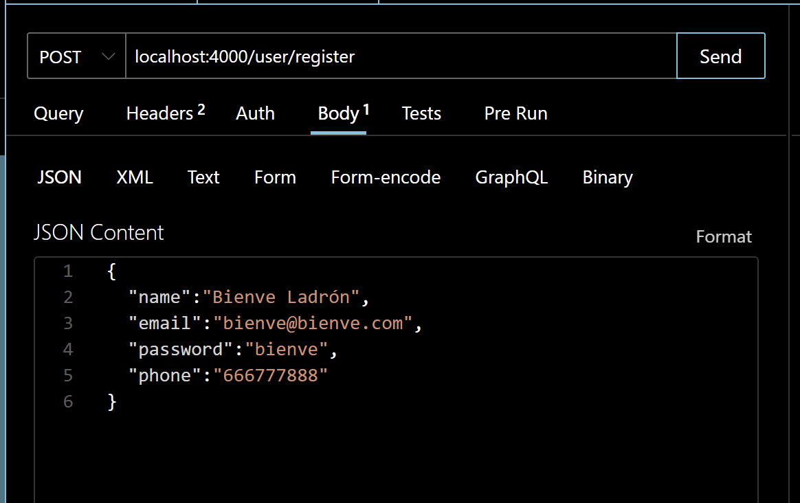
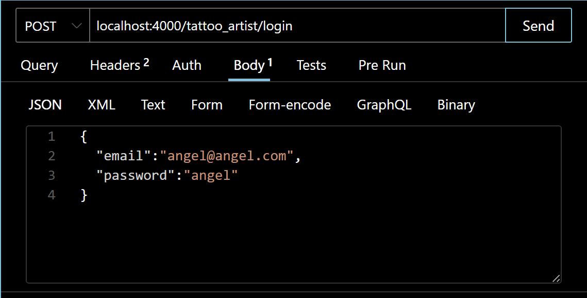
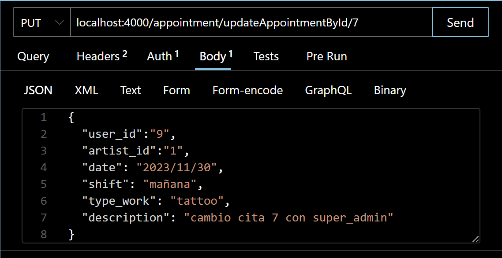
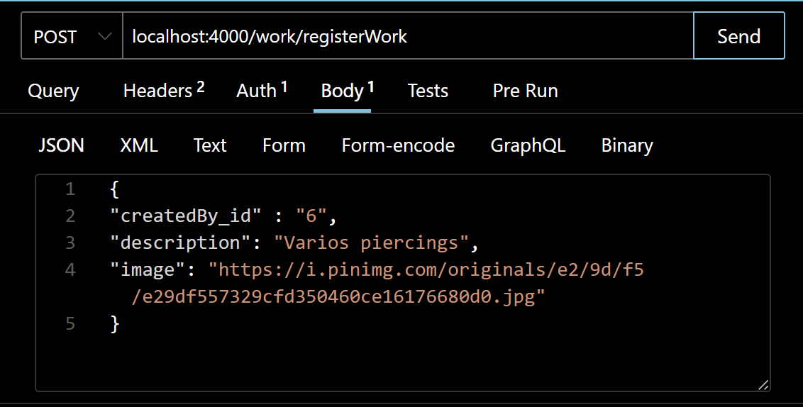

# API Tattoo Studio


<details>
  <summary>Contenido 📝</summary>
  <ol>
    <li><a href="#objetivo">Objetivo</a></li>
    <li><a href="#sobre-el-proyecto">Sobre el proyecto</a></li>
    <li><a href="#deploy-🚀">Deploy</a></li>
    <li><a href="#stack">Stack</a></li>
    <li><a href="#diagrama-bd">Diagrama</a></li>
    <li><a href="#instalación-en-local">Instalación</a></li>
    <li><a href="#endpoints">Endpoints</a></li>
    <li><a href="#futuras-funcionalidades">Futuras funcionalidades</a></li>
    <li><a href="#contribuciones">Contribuciones</a></li>
    <li><a href="#licencia">Licencia</a></li>
    <li><a href="#webgrafia">Webgrafia</a></li>
    <li><a href="#agradecimientos">Agradecimientos</a></li>
    <li><a href="#contacto">Contacto</a></li>
  </ol>
</details>

## Objetivo
Este proyecto de Gestion de Citas de un Estudio de tatuajes, requería una API funcional conectada a una base de datos con al menos una relación de uno a muchos y una relación de muchos a muchos.

## Sobre el proyecto
En esta aplicación el usuario puede registrarse, mostrar y modificar sus datos, asi como los tatuadores. 
El super_admin es quien tiene el control para poder eliminar usuarios y puede acceder a la mayoria de gestiones que pueden realizar los usuarios y tatuadores con su token.
Tambien he añadido la creacion de trabajos realizados por cada tatuador y las login por tatuador o de todos ellos.


## Deploy 🚀
<div align="center">
   <a href="https://github.com/Noeliamll76/Proyecto-4-Tatoo-Studio"><strong>Enlace a GitHub </strong></a>🚀🚀🚀
</div>

## Stack
Tecnologías utilizadas:
<div align="center">

<a href="https://www.expressjs.com/">
    
</a>
<a href="https://nodejs.org/es/">
    
</a>
<a href="https://developer.mozilla.org/es/docs/Web/JavaScript">
    
</a>
 </div>


## Diagrama BD


## Instalación en local
1. Clonar el repositorio
2. ` $ npm install `
3. Conectamos nuestro repositorio con la base de datos 
4. ``` $ Ejecutamos las migraciones ``` 
5. ``` $ Ejecutamos los seeders ``` 
6. ``` $ npm run dev ``` 


## Endpoints
<details>
<summary> Ejemplos de Endpoints</summary>








  
</details>

## Futuras funcionalidades
[ ] Añadir una funcion en la que se muestren las actuales formacione de los tatuadores para futuros trabajos.
[ ] ...

## Contribuciones
Las sugerencias y aportaciones son siempre bienvenidas.  

1. Crea un fork del repositorio
    - Crea una nueva rama  
        ```
        $ git checkout -b feature/nombreUsuario-mejora
        ```
    - Haz un commit con tus cambios 
        ```
        $ git commit -m 'feat: mejoraria estas sentencias'
        ```
    - Haz push a la rama 
        ```
        $ git push origin feature/nombreUsuario-mejora
        ```
    - Abre una solicitud de Pull Request

## Licencia
Este proyecto se encuentra bajo licencia de Noelia Marcos Lleonart.

## Webgrafia:
Para conseguir mi objetivo he recopilado información de:
- link a repositorios 
- link a documentacion de librerias externas
- ...


## Agradecimientos:

Como en la anterior ocasión y en la anterior, debo y quiero agradecer a todos mis compañeros del Bootcamp, por su paciencia y su inestimable ayuda, siempre están ahí mostrando su mejor cara cada vez que les pido ayuda.
Muchisimas gracias.


## Contacto
<a href = "mailto:noeliamll76@gmail.com"></a>

<a href="https://www.linkedin.com/feed/" target="_blank"></a> 
</p>